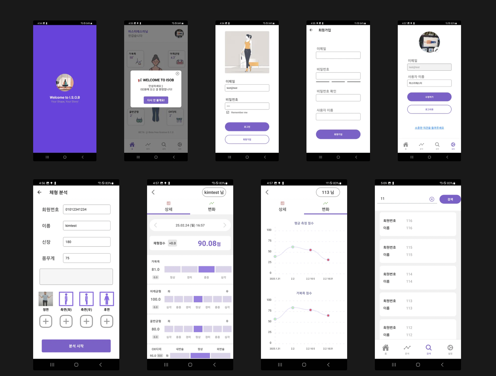
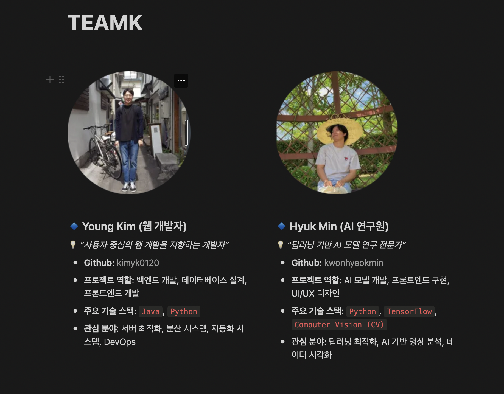

# [ISOB - AI 기반 자세 분석 애플리케이션](https://play.google.com/store/apps/details?id=com.isob)

### ▶️ ISOB?

**ISOB는 접근성이 뛰어난 스마트폰을 활용하여 자세 분석을 보다 쉽고 효과적으로 할 수 있도록 돕는 애플리케이션입니다. 
인공지능을 기반으로 한 자동 인체 인식 기술과 의학적 알고리즘을 통해 사용자의 자세를 정밀하게 분석하며, 시계열 데이터 기록과 그래프 기능을 통해 자세 변화를 추적할 수 있도록 설계되었습니다. 
또한, 분석 결과를 효율적으로 관리할 수 있는 기능을 제공하여 사용자들이 자신의 건강을 보다 체계적으로 관리할 수 있도록 돕습니다.**
[다운로드링크](https://play.google.com/store/apps/details?id=com.isob)

### ▶️ ISOB의 주요 기능

### 📌  스마트폰 기반의 인공지능 자세 분석

ISOB는 이동과 휴대가 편리한 스마트폰을 활용하여 자세 분석을 수행합니다. 인공지능 기반의 자동 인체 인식 기술을 적용하여 사용자의 신체를 정확하게 감지하고 분석할 수 있습니다. 이를 통해 사용자는 별도의 추가 장비 없이 스마트폰 하나만으로도 정밀한 자세 분석을 경험할 수 있습니다.

### 📌 4가지 주요 자세에 대한 분석 제공

의학적 알고리즘을 바탕으로, ISOB는 사용자의 네 가지 주요 자세에 대한 분석을 제공합니다. 분석 항목은 다음과 같습니다.

- **거북목(Turtle Neck Syndrome)**: 목이 앞으로 돌출되는 자세를 감지하고 경추 상태를 분석합니다.
- **어깨 균형(Shoulder Balance)**: 양쪽 어깨의 균형 상태를 분석하여 좌우 높이 차이를 감지합니다.
- **골반 균형(Pelvic Balance)**: 골반의 기울어짐 여부를 확인하여 신체 중심의 균형 상태를 분석합니다.
- **OX 다리(O/X Leg Analysis)**: 다리 정렬 상태를 분석하여 O자형 혹은 X자형 다리 여부를 판별합니다.

이러한 분석 결과를 통해 사용자는 자신의 신체 균형을 보다 정확하게 이해하고, 필요에 따라 적절한 교정 및 운동 계획을 세울 수 있습니다.

### 📌 시계열 데이터 기록 및 변화 추이 제공

ISOB는 사용자 자세의 변화를 추적할 수 있도록 분석 데이터를 시계열로 기록합니다. 이를 통해 사용자는 특정 기간 동안의 변화 추이를 그래프로 확인할 수 있으며, 자세 개선 여부를 한눈에 파악할 수 있습니다. 이러한 기능은 특히 지속적인 관리가 필요한 사용자들에게 큰 도움이 됩니다.

### 📌 분석 결과의 손쉬운 관리

ISOB는 사용자가 자신의 분석 결과를 손쉽게 관리할 수 있도록 빠른 검색 기능을 제공합니다. 분석 데이터가 쌓여도 손쉽게 과거 기록을 찾아볼 수 있습니다. 이를 통해 사용자들은 자신의 자세 변화를 효과적으로 모니터링하고, 개선 목표를 설정할 수 있습니다.

# 개발 여정

### 📱 프로젝트 계기

ISOB은 두 명의 개발 스터디 팀원으로 구성된 TEAMK의 사이드 프로젝트로 시작되었습니다. 

프로젝트의 발단은 팀원의 가족 중 한 명이 필라테스 센터를 운영하며, 회원들의 자세 분석과 교정에 도움을 줄 수 있는 애플리케이션이 있으면 좋겠다는 의견을 제시하면서 시작되었습니다. 

기존의 자세 동작 분석 기기는 가격이 높아 접근성이 떨어지는 문제가 있었기 때문에, 우리는 스마트폰을 활용하여 누구나 손쉽게 자세를 분석할 수 있는 기본에 충실한 애플리케이션을 개발하기로 결정하였습니다.

### 📱개발 스택

ISOB은 다음의 기술을 사용하여 개발되었습니다. 

📱 **프론트엔드**: React Native, Android

💻 **백엔드**: Java, Spring Boot, JPA, Swagger, JWT, Security, QueryDSL, Lombok

🗄️ **데이터베이스**: MariaDB

🎨 **UI**: Figma

🤝 **협업 도구**: Jira 애자일보드

🔄 CI/CD : Github Action

☁️ Cloud : Oracle Cloud

### 🔹 개발 프레임워크

ISOB 프로젝트에서는 **React Native**와 **Spring Boot**를 선택하여 프론트엔드와 백엔드 개발을 진행하였습니다.

**React Native**는 JavaScript를 사용해 네이티브 앱을 개발할 수 있는 프레임워크로, 기존의 웹 개발 경험을 바탕으로 모바일 앱 개발을 할 수 있다는 장점이 있었습니다. 특히 **React**와 비슷한 디자인 패턴을 따르므로, 개발자가 쉽게 적응할 수 있고, 한 번의 코드 작성으로 **iOS**와 **Android** 두 플랫폼에 동시에 앱을 배포할 수 있습니다. 이러한 특징 덕분에 개발 기간을 단축시키고 유지보수를 용이하게 만들었습니다.

**Spring Boot**는 **Java** 기반의 백엔드 개발 프레임워크로, 숙련된 프레임 워크여서 간편하고 빠르게 애플리케이션을 구축할 수 있어 백엔드 개발에 최적화된 선택이었습니다. **JPA**와 **QueryDSL**을 통해 데이터베이스와의 연동을 효율적으로 처리하고, **Spring Security**와 **JWT**로 보안을 강화하여 안정적인 백엔드 환경을 구축할 수 있었습니다. 또한, RESTful API 서버를 쉽게 구성할 수 있어 프론트엔드와의 연동이 원활하게 이루어졌습니다.

### 🔹 **협업 도구**

ISOB 프로젝트에서는 **Jira의 애자일 보드**를 활용하여 업무를 분배하고 체계적으로 관리하였습니다. 이를 통해 각 팀원의 진행 상황을 한눈에 파악하고, 효율적인 협업이 가능하도록 하였습니다.

### 🔹 **UI/UX 설계**

사용자 경험을 고려한 UI 디자인을 위해 **Figma**를 활용하여 화면 구성을 정의하고 시각적인 요소를 설계하였습니다. 이를 통해 프로젝트의 방향성과 디자인 일관성을 유지하며, 개발 단계에서 원활한 협업이 이루어질 수 있도록 하였습니다.

### 🔹 **API 설계 및 문서화**

백엔드와 프론트엔드 간 원활한 연동을 위해 **Swagger**를 사용하여 API 인터페이스를 정의하고 공유하였습니다. 이를 통해 팀원 간 명확한 API 구조를 설정하고, 협업 시 불필요한 의사소통 비용을 줄일 수 있도록 하였습니다.

### 🔹 **데이터베이스 설계**

데이터 모델링 및 스키마 정의를 위해 **ERD Cloud**를 활용하여 ERD를 설계하고 관리하였습니다. 이를 통해 데이터 구조를 시각화하고, 일관된 데이터 모델을 유지하면서 효과적인 데이터베이스 설계가 이루어졌습니다.

### 🔹 CI/CD

ISOB 프로젝트에서는 **Github Action**을 사용하여 **CI/CD 파이프라인**을 구축하였습니다. 이를 통해 코드 변경이 있을 때마다 자동으로 빌드, 테스트, 배포 과정이 이루어지도록 설정하였습니다.

### 🔹 AI 라이브러리 개발

JNI를 활용해 C++에서 Java의 AssetManager를 호출하여 TFLite 모델 파일을 바이너리로 로드하였으며, C++과 OpenCV를 사용해 데이터 전처리를 수행하고, TFLite의 Movenet 모델을 GPU 모드로 최적화하여 추론을 실행하였습니다.

<!--  -->

